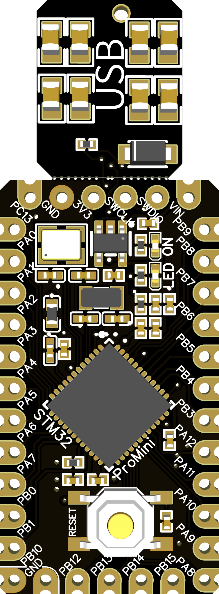

# STM32 Pro Mini
- STM32 Pro Mini dev board
  - 17.8 x 33mm size (excluding USB port)
  - 28 GPIOs
- Based on STM32F411CEU6 MCU (100MHz ARM Cortex M4 CPU, 512kB Flash, 128kB SRAM) or STM32F103CxT6 MCU (72MHz ARM Cortex M3 CPU, 64kB/128kB Flash, 20kB SRAM)
  - Virtually support all 48 pin packaged(LQFP48, UFQFPN48, ...) STM32 MCUs.

- Two main devices are being supported as of now, one with STM32F103Cx and the other with STM32F411Cx.




## Getting a board
### Manufacture yourself
  - You can manufacture your own STM32 Pro Mini board with provided files in this repo.
  - Use gerber files in [fabrication/gerber/v6](fabrication/gerber/v6) directory.
  - Use BOM and CPL(Pick&Place) files included in [fabrication](fabrication) directory.
  - Recommended board specifications:
    - Material: FR-4
    - Layers: 2
    - PCB color / silk color: Any
    - Thickness: 1.0mm
    - Surface finish: ENIG
  - All parts can be placed with included BOM/CPL file.

### Get a free board
- Leave an issue and I may send you a free STM32 Pro Mini board.

## Variants and generations
| Gen | CPU | Versions | Features | Board peripheral | Default BOOT configuration |
|-|-|-|-|-|-|
| 1 | STM32F103Cx | V1 (STM32F103C8), V3 (STM32F103CB) | 8MHz ±20ppm HSE, Compatible with common 'Blue Pill' development boards. | None | BOOT0 (0) BOOT1 (0) |
| 2 | STM32F411CE | V2 | 8MHz ±20ppm HSE | Removable USB port | BOOT0 (0) BOOT1 (0) |
| 3 | STM32F411CE | V4, V5, V6 | 12MHz ±10ppm HSE, 32.768kHz ±20ppm LSE (V5, V6), A dedicated analog power rail with noise supression (V5, V6), Castellated edges (V6 only) | Removable USB port | BOOT0 (0) BOOT1 (0) |

### ProMini 3rd gen (F411 (V4, V5, V6))
* Fully redesigned STM32 Pro Mini dev board
* A dedicated analog voltage supply for noise reduction (from V5 and afterwards)
* Ultra low noise, low Iq LDO regulator added to minimize static power draw. (from V5 and afterwards)
* LSE crystal added (from V5 and afterwards)
* PB11 pin is removed and additional GND pin is added.

### ProMini 2nd gen (F411 (V2))
* Based on STM32F411CEU6 MCU 
* PB11 is disabled in this variant, being used to connect a capacitor to supply internal voltage.

#### BOM
* 2.2uF or 4.7uF ceramic capacitor with low ESR have to placed on C13.
* USB pull-up resistor R1 is not needed. (The MCU integrates pull-up resistor for USB D+.)

### ProMini 1st gen (F103 (V1, V3))
* Based on STM32F103C8T6 (V1) / STM32F103CBT6 (V3) MCU
* Compatible with common Blue Pill development board with STM32F103C8T6, except for absence of 32.768kHz crystal.

#### BOM
* C13 is not needed in F103 variant.
* An 1.5k pull-up resistor R1 for USB D+ is needed.

#### Schematic

[PDF version](schematic/schematic.pdf)

#### PCB layout


## Setup for Arduino IDE
- Install STM32duino package along with STM32CubeProgrammer.
- Add ```./variants/PROMINI_F411``` (V3-V4) or ```./variants/PROMINI_F411_V5``` (V5, V6)  directory to Arduino IDE ```packages/STM32/hardware/stm32/(version)/variants``` directory.
- Add the content of ```boards-add.txt``` to ```packages/STM32/hardware/stm32/(version)/boards.txt```.

### Programming
- [USB HID bootloader fork](https://github.com/hletrd/STM32_HID_Bootloader) may be used to upload using the integrated USB port.

### Tutorial
- [Getting started with STM32 Pro Mini](TUTORIAL.md)